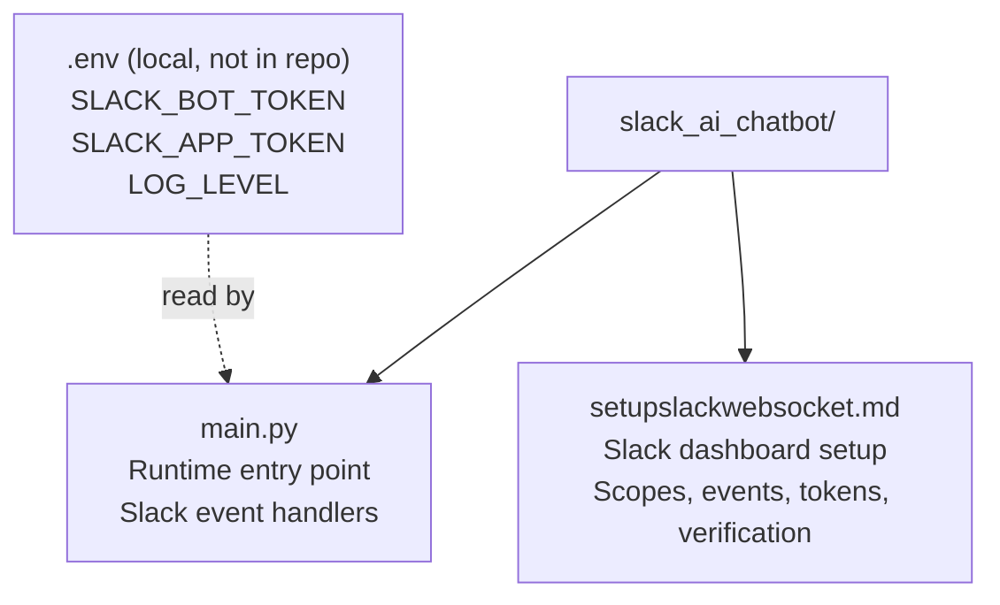
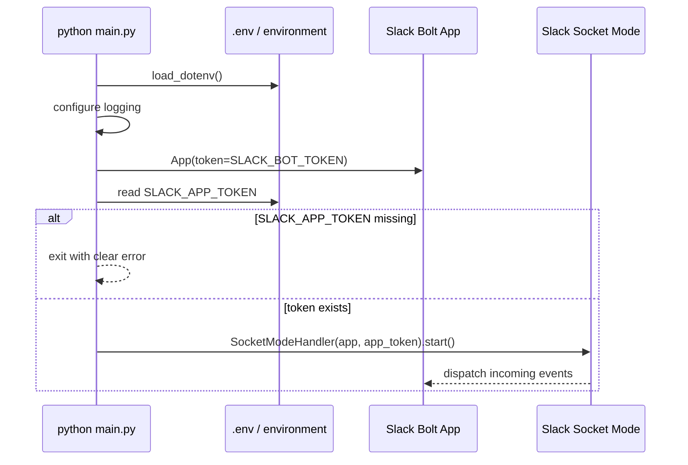
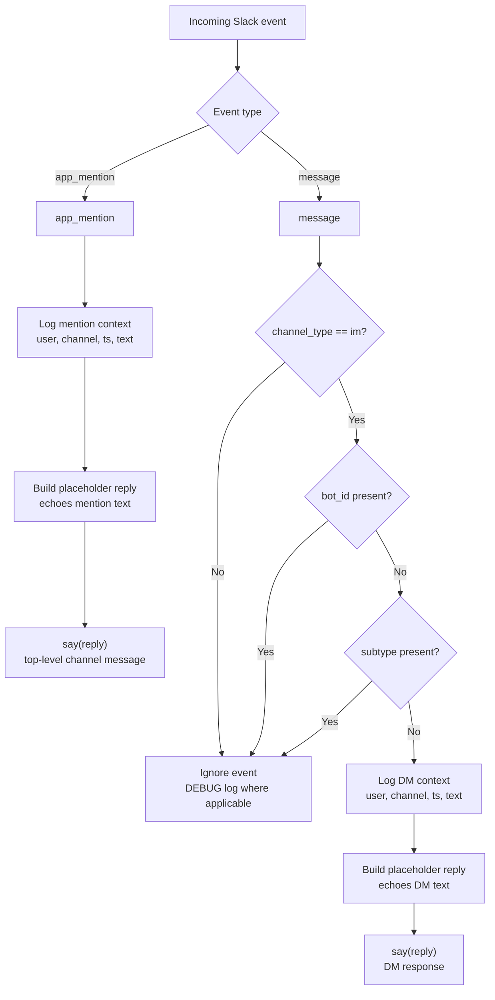

# Slack AI Chatbot Architecture

This project is a small Slack Bolt application that runs locally in Socket Mode.
It does not expose an HTTP server. Slack delivers events over a WebSocket opened
by `SocketModeHandler`, and replies are sent back to Slack through Bolt's `say`.

## Step 1 - File Map



| File | Responsibility |
| --- | --- |
| `main.py` | Starts the Slack bot, loads environment variables, configures logging, registers event handlers, and opens the Socket Mode connection. |
| `setupslackwebsocket.md` | Documents how to configure the Slack app, token scopes, event subscriptions, Socket Mode, local environment, and verification steps. |
| `.env` | Expected local configuration file. It provides Slack tokens and optional logging level, but it is not present in the current file list. |

## Step 2 - Runtime Architecture

```mermaid
flowchart LR
    user["Slack user"]
    slack["Slack workspace<br/>Slack app + Events API"]

    subgraph local["Local Python process: python main.py"]
        dotenv["load_dotenv()<br/>loads .env"]
        logging["logging.basicConfig()<br/>LOG_LEVEL or INFO"]
        bolt["Bolt App<br/>token = SLACK_BOT_TOKEN"]
        socket["SocketModeHandler<br/>app_token = SLACK_APP_TOKEN"]
        mention["handle_mentions()<br/>app_mention"]
        dm["handle_direct_messages()<br/>message events filtered to DMs"]
        ctx["_event_context()<br/>log helper"]
    end

    user --> slack
    slack <-->|WebSocket events<br/>xapp token| socket
    dotenv --> bolt
    dotenv --> socket
    dotenv --> logging
    socket --> bolt
    bolt --> mention
    bolt --> dm
    mention --> ctx
    dm --> ctx
    mention -->|say(reply)<br/>chat.postMessage via bot token| slack
    dm -->|say(reply)<br/>chat.postMessage via bot token| slack
```

## Step 3 - Startup Flow



## Step 4 - Event Handling Flow



## Step 5 - Component Breakdown

1. Environment loading:
   `load_dotenv()` loads `SLACK_BOT_TOKEN`, `SLACK_APP_TOKEN`, and optional
   `LOG_LEVEL` from `.env` into `os.environ`.

2. Logging:
   `logging.basicConfig(...)` writes timestamped logs to stdout. `LOG_LEVEL`
   defaults to `INFO`.

3. Slack app creation:
   `app = App(token=os.environ.get("SLACK_BOT_TOKEN"))` creates the Bolt app.
   This bot token is used when the app replies through Slack Web API calls.

4. Socket Mode startup:
   `main()` reads `SLACK_APP_TOKEN`. If it is missing, the process exits. If it
   exists, `SocketModeHandler(app, app_token).start()` opens the WebSocket and
   blocks while the bot runs.

5. Mention handler:
   `@app.event("app_mention")` routes channel mentions to `handle_mentions`.
   The handler logs context, builds a placeholder echo reply, and sends a
   top-level channel response with `say(reply)`.

6. Direct message handler:
   `@app.event("message")` receives message events, but
   `handle_direct_messages` only responds when `channel_type == "im"`. It skips
   bot-authored messages and subtype events, then logs, builds a placeholder
   echo reply, and responds with `say(reply)`.

7. Log context helper:
   `_event_context(event)` formats `user`, `channel`, and `ts` into a stable
   one-line string used by both handlers.

## Step 6 - Current External Dependencies

| Dependency | Used for |
| --- | --- |
| `slack-bolt` | Slack app object, event routing, Socket Mode handler, and reply helper. |
| `python-dotenv` | Loading `.env` values into environment variables. |
| Slack app configuration | Enables Socket Mode, bot scopes, and event subscriptions described in `setupslackwebsocket.md`. |

## Step 7 - Current Limitations And Extension Points

| Area | Current behavior | Natural extension |
| --- | --- | --- |
| AI logic | Placeholder echo responses in both handlers. | Replace reply construction with an LLM, RAG, or workflow call. |
| Threading | Replies are top-level messages because `say(reply)` does not pass `thread_ts`. | Add `thread_ts` when threaded replies are desired. |
| Message events | Non-DM `message` events are ignored. | Subscribe to and handle channel messages only if needed. |
| Configuration validation | `SLACK_APP_TOKEN` is checked explicitly; `SLACK_BOT_TOKEN` is passed to Bolt as-is. | Add startup validation for all required env vars. |
| Tests | No test files are present. | Add unit tests for event filtering and reply generation once AI logic is introduced. |
