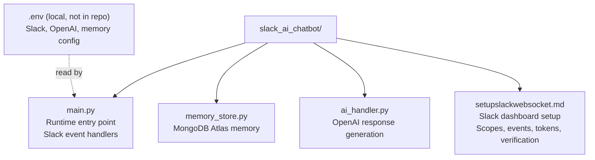
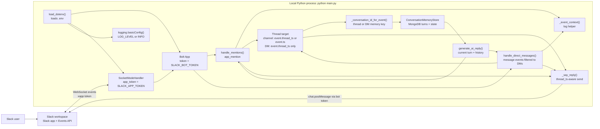
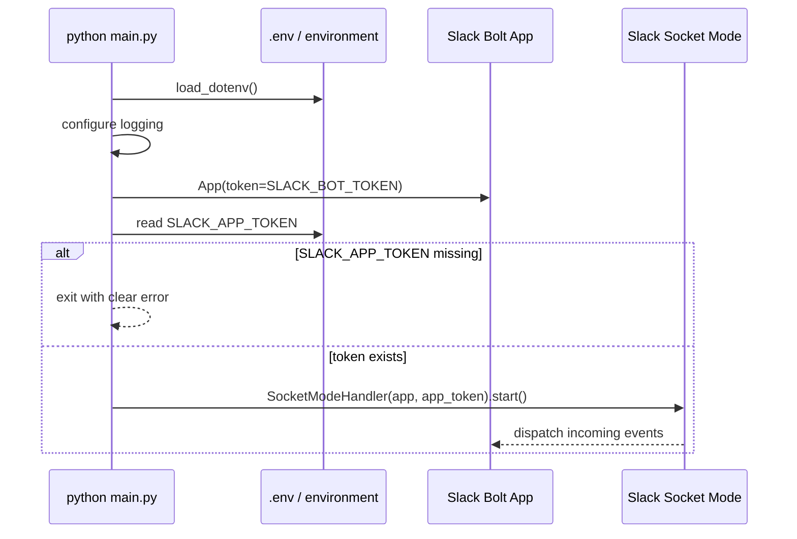
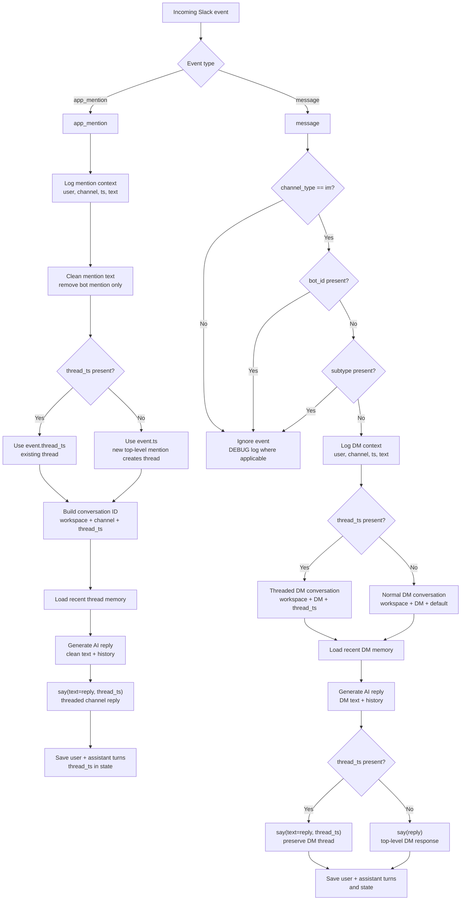

# Slack AI Chatbot Architecture

This project is a small Slack Bolt application that runs locally in Socket Mode.
It does not expose an HTTP server. Slack delivers events over a WebSocket opened
by `SocketModeHandler`, and replies are sent back to Slack through Bolt's `say`.

## Step 1 - File Map

| File | Responsibility |
| --- | --- |
| `main.py` | Starts the Slack bot, loads environment variables, configures logging, registers event handlers, loads memory, and opens the Socket Mode connection. |
| `ai_handler.py` | Calls OpenAI with the current user turn plus optional recent memory turns. |
| `memory_store.py` | Stores conversations, role turns, and state in MongoDB Atlas. |
| `setupslackwebsocket.md` | Documents how to configure the Slack app, token scopes, event subscriptions, Socket Mode, local environment, and verification steps. |
| `.env` | Expected local configuration file. It provides Slack tokens, OpenAI config, logging, and memory settings, but it is not present in the current file list. |

## Step 2 - Runtime Architecture

## Step 3 - Startup Flow

## Step 4 - Event Handling Flow

## Step 5 - Component Breakdown

1. Environment loading:
   `load_dotenv()` loads `SLACK_BOT_TOKEN`, `SLACK_APP_TOKEN`, and optional
   `LOG_LEVEL` from `.env` into `os.environ`.

2. Logging:
   `logging.basicConfig(...)` writes timestamped logs to stdout. `LOG_LEVEL`
   defaults to `INFO`.

3. Slack app creation:
   `app = App(token=os.environ.get("SLACK_BOT_TOKEN"))` creates the Bolt app.
   This bot token is used when the app replies through Slack Web API calls.

4. Socket Mode startup:
   `main()` reads `SLACK_APP_TOKEN`. If it is missing, the process exits. If it
   exists, `SocketModeHandler(app, app_token).start()` opens the WebSocket and
   blocks while the bot runs.

5. Mention handler:
   `@app.event("app_mention")` routes channel mentions to `handle_mentions`.
   The handler logs context, removes the bot mention, derives a conversation ID
   from workspace + channel + thread timestamp, loads recent memory, generates
   an AI reply, posts the response in a Slack thread, then saves the user and
   assistant turns. Existing thread replies use `event["thread_ts"]`; top-level
   mentions use their own `event["ts"]` to create the thread.

6. Direct message handler:
   `@app.event("message")` receives message events, but
   `handle_direct_messages` only responds when `channel_type == "im"`. It skips
   bot-authored messages and subtype events, then logs, loads DM memory,
   generates an AI reply, posts the response, and saves the turn pair.
   Normal DMs use one ongoing memory key per DM channel. If the incoming DM is
   already inside a Slack thread, the response keeps that `thread_ts` and uses a
   separate threaded DM memory key.

7. Memory store:
   `memory_store.py` connects to MongoDB Atlas using `MONGODB_URI`.
   The `conversations` collection stores channel, thread, timestamps, and
   state. The `conversation_turns` collection stores ordered role/content
   history (`user`, `assistant`, `system`, or `tool`). The model receives the
   most recent `MEMORY_MAX_TURNS` role turns.

8. Log context helper:
   `_event_context(event)` formats `user`, `channel`, and `ts` into a stable
   one-line string used by both handlers.

## Step 6 - Current Runtime Dependencies

| Dependency | Used for |
| --- | --- |
| `slack-bolt` | Slack app object, event routing, Socket Mode handler, and reply helper. |
| `python-dotenv` | Loading `.env` values into environment variables. |
| `openai` | Responses API client used by `ai_handler.py`. |
| `pymongo` | MongoDB Atlas client for persistent memory. |
| `dnspython` | DNS SRV resolution for `mongodb+srv://` Atlas connection strings. |
| Slack app configuration | Enables Socket Mode, bot scopes, and event subscriptions described in `setupslackwebsocket.md`. |

## Step 7 - Current Limitations And Extension Points

| Area | Current behavior | Natural extension |
| --- | --- | --- |
| AI logic | Replies are generated through `ai_handler.generate_ai_reply` with recent memory history. | Extend with RAG, tools, or workflow calls. |
| Memory | MongoDB Atlas stores role turns and state by Slack thread or DM key. | Add summarization or retention cleanup for long-running workspaces. |
| Threading | Channel mentions reply in threads using `thread_ts`; DMs stay top-level unless already threaded. | Use thread state to support workflows and handoffs. |
| Message events | Non-DM `message` events are ignored. | Subscribe to and handle channel messages only if needed. |
| Configuration validation | `SLACK_APP_TOKEN` is checked explicitly; `SLACK_BOT_TOKEN` is passed to Bolt as-is. | Add startup validation for all required env vars. |
| Tests | `tests/test_threaded_replies.py`, `tests/test_memory_store.py`, and `tests/test_ai_handler_memory.py` cover threading, MongoDB memory behavior, and AI history input. | Add broader event-filtering tests as behavior grows. |
