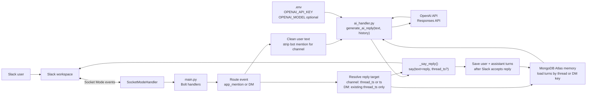
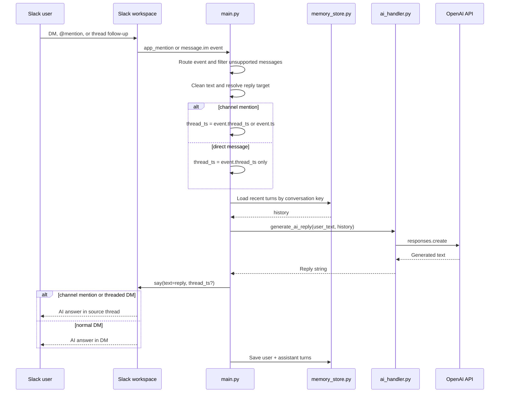

# Video 2 Diagram: Real AI Responses

This diagram supports Video 2: replacing the placeholder echo bot with a real
AI response generator while keeping Slack event handling easy to read.

Current runtime note: the diagram now includes threaded replies and MongoDB
Atlas conversation memory. See [`ARCHITECTURE.md`](../../../ARCHITECTURE.md)
for the full end-to-end design.

## Main Slide

Use this flowchart on camera when you explain the split between Slack plumbing and AI logic.
The standalone preview file [`flow-walkthrough.md`](flow-walkthrough.md) shows the same diagram with a shorter walkthrough. Open [`flowchart.svg`](flowchart.svg) for a rendered image; edit [`flowchart.md`](flowchart.md) to regenerate it.



### Main slide explanation

| Step | What happens | Why it matters |
| --- | --- | --- |
| User → Slack | A DM, @mention, or thread follow-up hits the workspace. | Same event entry points, now with threaded reply behavior. |
| Socket Mode | Events arrive over a WebSocket via `SocketModeHandler`. | No inbound HTTP server or ngrok tunnel for local dev. |
| `main.py` | Bolt routes `app_mention` and DM `message` events. | Keeps Slack tokens, logging, filtering, and event wiring in one place. |
| Clean text | Remove bot mention markup for channel mentions. | The model should see the user's question, not Slack formatting. |
| Resolve target | Channel mentions use `event.thread_ts` or `event.ts`; DMs use `event.thread_ts` only when already threaded. | Replies land in the right Slack thread without forcing normal DMs into threads. |
| Memory | MongoDB loads recent turns by channel thread, normal DM, or threaded DM key. | The model gets the relevant local conversation, not unrelated Slack history. |
| `ai_handler.py` | `generate_ai_reply(user_text, history=history)` returns the answer string. | All prompts, SDK calls, and AI errors stay out of `main.py`. |
| `.env` | `OPENAI_API_KEY`, optional `OPENAI_MODEL`. | Secrets and model name without hardcoding in Python. |
| OpenAI API | Responses API generates the answer text. | Official OpenAI only in this video — one straight path. |
| `_say_reply()` | Bolt posts with `thread_ts` when needed, otherwise sends a normal DM reply. | User sees channel answers in threads and normal DMs remain top-level. |
| Save turns | User and assistant turns are saved after Slack accepts the reply. | Follow-up questions can use the latest context. |

In one sentence for the audience: **Slack events still flow through `main.py`, but replies now resolve a thread target, load memory, call `generate_ai_reply()`, then post back with `_say_reply()`.**

## Sequence View



## File Boundary

| File | Responsibility |
| --- | --- |
| `main.py` | Slack tokens, Bolt app setup, event handlers, filtering, thread target resolution, memory calls, and `_say_reply(...)`. |
| `ai_handler.py` | OpenAI client setup, prompt, model env vars, AI errors, and `generate_ai_reply(..., history=...)`. |
| `memory_store.py` | MongoDB Atlas conversation keys, role turns, and lightweight state. |
| `requirements.txt` | Adds the OpenAI SDK, Slack Bolt, dotenv, and MongoDB dependencies. |
| `.env` | Slack tokens, `OPENAI_API_KEY`, optional `OPENAI_MODEL`, and MongoDB settings. |

## Talking Points

1. Video 1 proved the bot can receive Slack events.
2. Video 2 changes the response generator while keeping Slack routing separate.
3. `main.py` should stay operational: receive Slack event, resolve reply target,
   load memory, call helper, send reply, save turns.
4. `ai_handler.py` should own every model decision so memory, summaries, or tools
   do not rewrite Slack handlers.
5. Thread support is a Slack delivery concern: channel mentions pass
   `thread_ts`, normal DMs do not, and threaded DMs preserve Slack's `thread_ts`.
6. We use OpenAI's **Responses API** in `ai_handler.py` — the recommended path for new OpenAI text projects.

## Implementation Shape

```python
# main.py
from ai_handler import generate_ai_reply

thread_ts = _thread_ts_for_reply(event)
conversation_id = _conversation_id_for_event(event, thread_ts=thread_ts)
store, history, _ = _load_memory_history(conversation_id, event, thread_ts=thread_ts)
reply = generate_ai_reply(user_text, history=history)
_say_reply(say, reply, thread_ts=thread_ts)
```

```python
# ai_handler.py
def generate_ai_reply(user_text: str, history=None) -> str:
    """Return a short Slack-friendly AI response."""
```

## Source Notes

OpenAI's docs describe the Responses API as the recommended interface for new
OpenAI text generation projects. This video keeps that choice inside `ai_handler.py`
so Slack code never cares which model name you set in `.env`.

- OpenAI Responses API: https://platform.openai.com/docs/api-reference/responses
