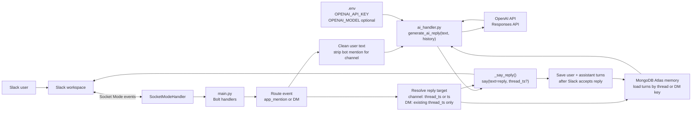

# Video 2: AI response flow

Short walkthrough for the main flowchart. See [README.md](README.md) for the sequence diagram, file boundaries, and talking points.

This diagram shows how a Slack message becomes an AI-generated threaded reply.
The Slack side stays in `main.py`; model decisions stay in `ai_handler.py`, and
MongoDB memory is keyed by the Slack thread or DM conversation.

## Main slide

## How to read this slide

1. **Slack user → workspace** — Someone DMs the bot, @-mentions it, or follows up in a thread.
2. **Socket Mode** — `SocketModeHandler` keeps a WebSocket open to Slack, so you do not need a public webhook URL.
3. **`main.py`** — Bolt routes `app_mention` and DM `message` events, then filters out non-DMs, bot echoes, and subtype events.
4. **Clean the message** — Channel mentions strip only the bot mention; DM text is used as-is after trimming.
5. **Resolve the target** — Channel mentions use `event.thread_ts` or the message `ts`; DMs only pass `thread_ts` when Slack already sent one.
6. **Load memory** — MongoDB returns recent turns for the channel thread, normal DM, or threaded DM key.
7. **`ai_handler.py`** — `generate_ai_reply(user_text, history=history)` calls OpenAI and returns a Slack-friendly string.
8. **`_say_reply()`** — Bolt posts with `thread_ts` for channel threads and threaded DMs, otherwise `say(reply)` keeps normal DMs top-level.
9. **Save turns** — After Slack accepts the reply call, the user and assistant turns are written back to MongoDB.

**Video 1** proved events reach the bot. **Video 2** adds the model call, and the current runtime now wraps it with thread targeting plus memory load/save steps.
