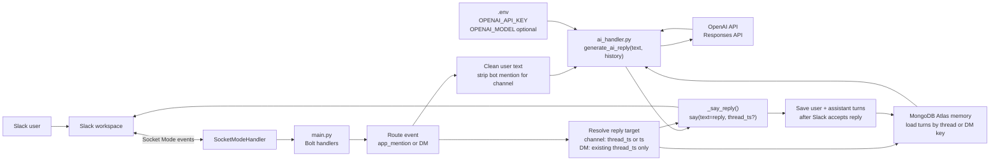

# Video 2: Main flowchart

Mermaid source for the AI response, threaded reply, and memory flow. Regenerate
[`flowchart.svg`](flowchart.svg) after edits.

This keeps the Video 2 AI split visible while adding the current runtime steps
for Slack thread replies and MongoDB Atlas memory.

